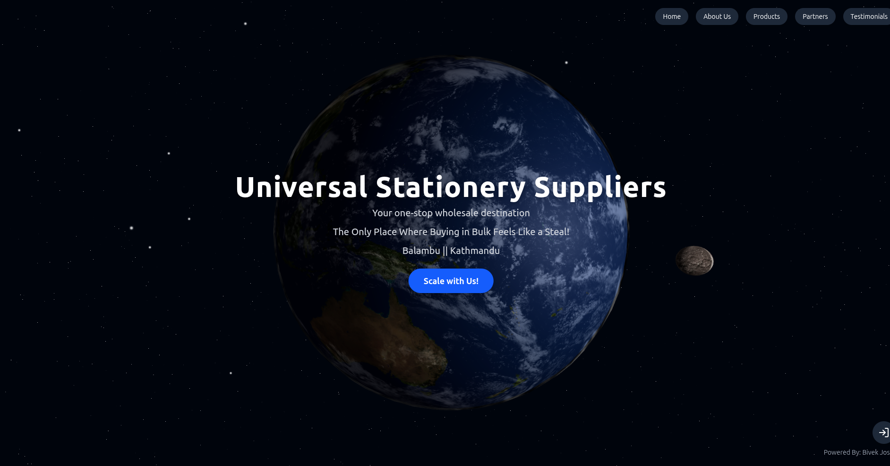

# 🪐 Universal Stationery Suppliers



Your **one-stop wholesale destination** for all stationery needs.  
We make **bulk buying simple, affordable, and reliable**.

---

## 🚀 About the Project

Universal Stationery Suppliers is a modern web platform designed to showcase wholesale stationery products.  
It provides information about products, partners, and customer testimonials — built with a futuristic design powered by **React + TypeScript + Vite**.

📍 Location: **Balambu, Kathmandu**  
✨ Motto: _“The Only Place Where Buying in Bulk Feels Like a Steal!”_

---

## 🛠️ Tech Stack

- ⚛️ **React 18**
- 🎨 **TypeScript**
- ⚡ **Vite**
- 🪄 **Tailwind CSS / MUI (if used)**
- 🌍 Deployed with **[Your hosting provider, e.g., Vercel/Netlify]**

---

## 📂 Features

- 🌍 Beautiful 3D Earth landing page
- 📑 Product showcase
- 🤝 Partners section
- 💬 Testimonials from clients
- 📱 Fully responsive design

---

## 📦 Installation & Setup

1. Clone the repository:
   ```bash
   git clone https://github.com/yourusername/universal-stationery-suppliers.git
   cd universal-stationery-suppliers
   ```
